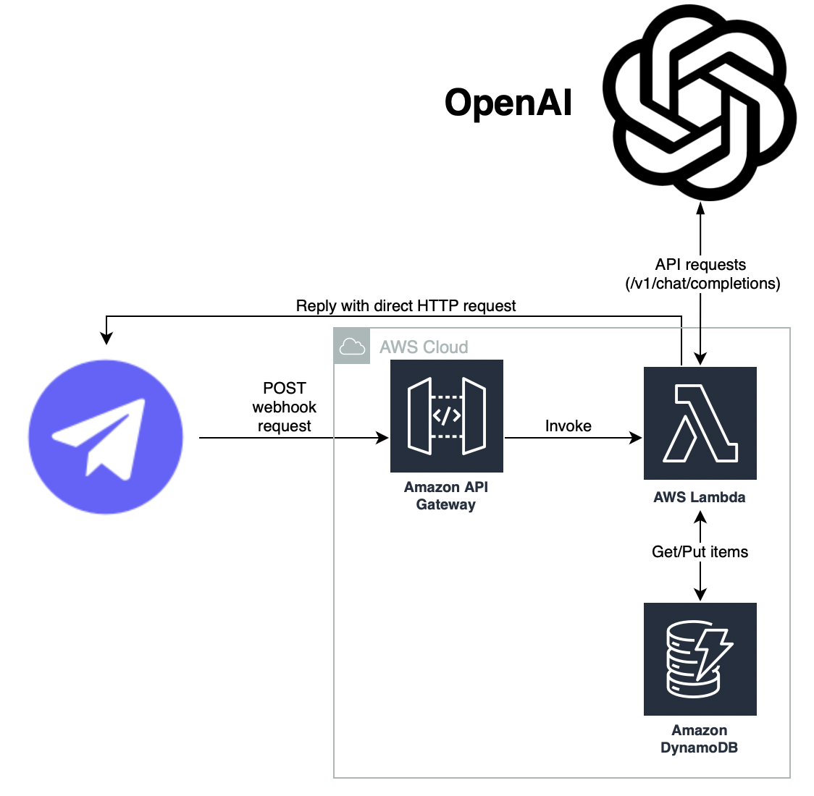

# AWS Telegram bot

Делаем полезного telegram бота для получения кухонных рецептов от AI на AWS Free Tier. Диаграмма работы бота представлена ниже.
Для получения нового рецепта он обращается к OpenAI по API и сохраняет его в AWS DynamoDB. Если нужно найти уже записанный рецепт, идет обращение к БД с поиском по определенному ингредиенту. Также можно вывести уже занесенный в БД рецепт по его ID.

## Функционал бота

Команды бота (нужно вводить их первым словом без дополнительных знаков вначале):

+ **PING** - Проверка работоспособности сервиса (пример: *PING*, ответ: *Pong* (см. раздел [Кастомизация](#кастомизация)));

+ **RECIPE** - Обращение к OpenAI модели для вывода нового рецепта (с занесением в базу данных) с указанными ингредиентами. Ингредиенты указываются через запятую без пробела (если ингредиент 1 - запятая не указывается) (пример: *RECIPE говядина,сливки* или *RECIPE говядина*, ответ: < Сам_рецепт > или *"LLM postprocessing was done incorrectly"* (см. раздел [Кастомизация](#кастомизация)));

+ **SEARCH** - Обращение к БД для вывода рецепта с указанным ингредиентом. Ингредиент указывается так, как он может встречаться в БД (пример: *SEARCH говядин*, ответ: <ID_рецепта> - <Название_рецепта> (построчно) или *"Found 0 recipes with mentioned ingredient"* (см. раздел [Кастомизация](#кастомизация)));

+ **GET** - обращение к базе данных для вывода рецепта с определенным ID (пример: *GET 1*, ответ: < Сам_рецепт > или *"Wrong ID of receipt, try again!"* (см. раздел [Кастомизация](#кастомизация))).

## Кастомизация

+ Структуру выводимых рецептов (а также абзацы, заносимые в БД) можно изменять через файл [ai_recipe.py](src/openai_api/ai_recipe.py);

+ Промпт можно изменить через файл [request.py](src/openai_api/ai_recipe.py);

+ Ответы бота на разные команды в ТГ (В том числе на неудачные запросы) можно изменить в [reply.py](src/reply_phrases/reply.py).

## [AWS Lambda](https://aws.amazon.com/pm/lambda/)

В поле *"Create Function"* выбираем *"Use a blueprint"*, в *"Blueprint name"* выбираем *"Hello world function - Python3.10"*, даем кастомное название и следим чтобы в *"Runtime"* было *"python3.10"* а в *"Architecture"* было *"x86_64"*. В *"Execution role"* выбираем *"Create a new role with basic Lambda permissions"*.

[CI/CD джоба](.github/workflows/lambda_deployment.yaml) в Github Actions настроена на деплой файла [lambda_function.py](src/lambda_function.py) вместе со всей папкой src и зависимостями в лямбда-функцию.

## [AWS DynamoDB](https://aws.amazon.com/dynamodb/)

Была создана таблица в **AWS DynamoDB** (название таблицы указывается в *AWS_DYNAMODB_TABLE*), в качестве *Partition key* используем *RecipeID* (порядковый номер рецепта в базе). В качестве Table settings указываем Default settings.

## [AWS CodePipeline](https://docs.aws.amazon.com/codepipeline/latest/userguide)

В данном примере AWS CodePipeline используется только для проверки кода на соответствие code styles.

### AWS CLI
https://docs.aws.amazon.com/cli/latest/reference/codepipeline/create-pipeline.html

### AWS Console
Создаем пайплайн через кнопку [Create pipeline](https://us-east-1.console.aws.amazon.com/codesuite/codepipeline/pipeline/new?region=us-east-1)

1. **Step 1** - *Choose creation option* - Выбираем Create pipeline from template

2. **Step 2** - *Choose template* - В Category выбираем Continuous Integration, в Template - CI Build Python

3. **Step 3** - *Choose source* - в Source provider выбираем Github (via Github App), в поле Connection выбираем Connect to Github. После этого появляется всплывающее окно, в котором нужно будет ввести (придумать - например aws-github-conn) имя будущего соединения с github и нажать на Connect to Github. Github будет спрашивать разрешение на интеграцию с AWS и репозитории, которые будут доступны в рамках этого connection. Соглашаемся и ждем закрытия окна (или сообщения об успешном коннекте). Возвращаемся в изначальное окно, в поле Connection выбираем только что созданный connection, в поле Repository name выбираем наш репозиторий, в поле default branch выбираем main. В поле Output artifact format выбираем CodePipeline default.

4. **Step 4** - *Configure template* - в поле CodePipelineName вводим имя (например DefaultPipeline), в CICodeBuildSpec - содержимое файла [codepipeline.yaml](aws_services/codepipeline.yaml)

## Настраиваемые переменные

1. **AWS_ACCESS_KEY** - Ключ от кредов aws для обращения к сервисам (кладется в *Repository secrets* в *Github*);

2. **AWS_SECRET_KEY** - Секрет от кредов aws для обращения к сервисам (кладется в *Repository secrets* в *Github*);

3. **AWS_FUNCTION_NAME** - ARN поднимаемой лямбда-функции (кладется в *Repository secrets* в *Github*);

4. **TELEGRAM_BOT_TOKEN** - Токен поднимаемого телеграм-бота (кладется в *Repository secrets* в *Github*);

5. **OPENAI_API_KEY** - Токен для обращения к моделям OpenAI (кладется в *Repository secrets* в *Github*);

6. **OPENAI_MODEL** - Модель OpenAI, к которой идет обращение (указывается в файле *.env_template*);

7. **AWS_DYNAMODB_TABLE** - название создаваемой в DynamoDB таблицы (указывается в файле *.env_template*).